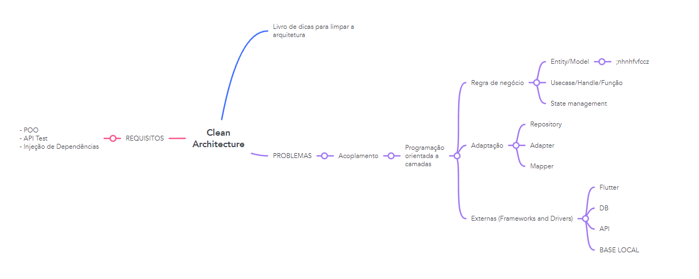
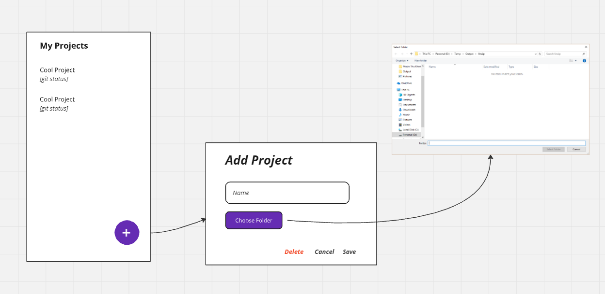

# flutter_clean_arch

Um programa que gerencia os projetos, onde vc possa ver os status do git e abrir o projeto com um click no VSCode.

## ARQUITETURA

## MOCKUP

## LINKS ÚTEIS

- [Aprenda o que é arquitetura](https://www.youtube.com/watch?v=6i-n_h1xgIs)
- [Aprenda o que é Arquitetura Limpa](https://youtu.be/zM8VMFlz0jo)
- [Veja sobre o MiniCore](https://github.com/Flutterando/minicore)